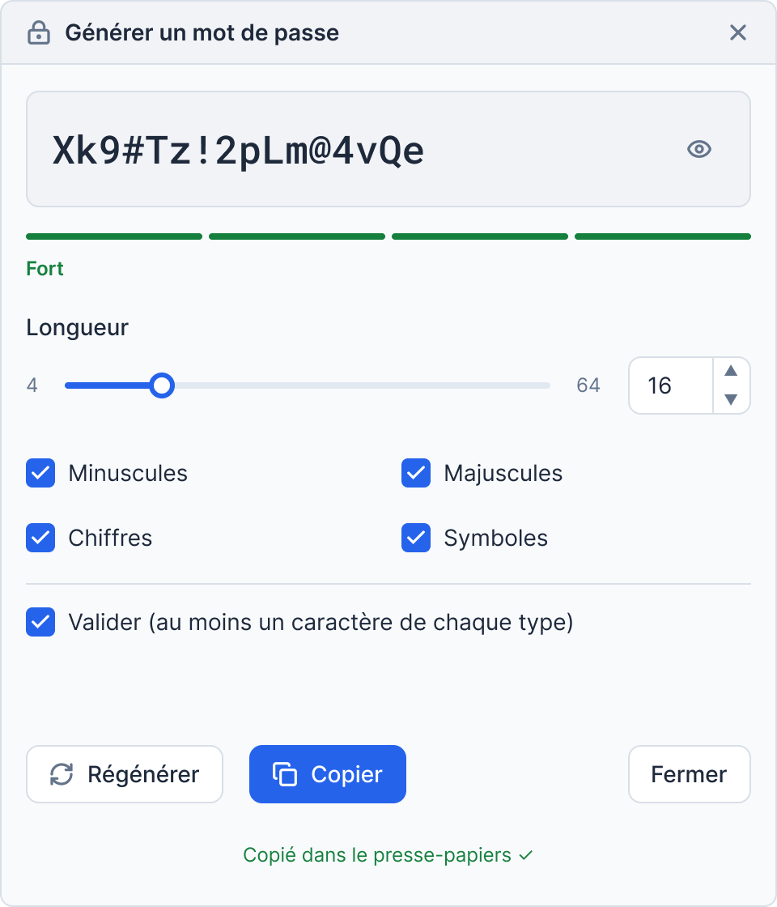
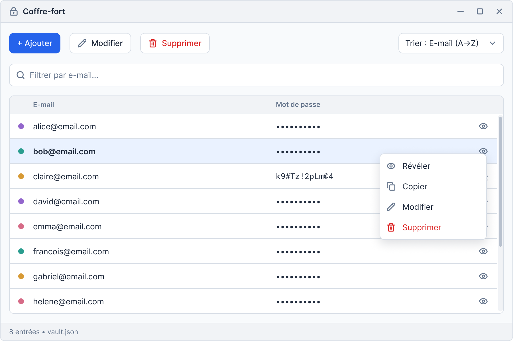
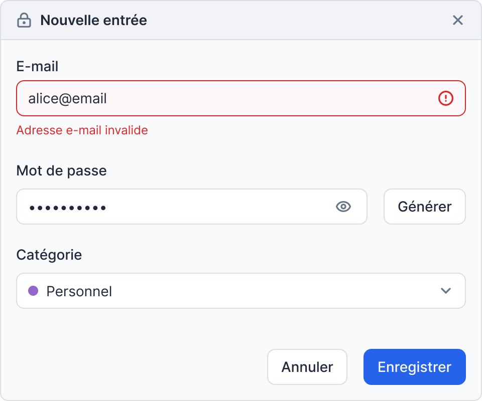

# Gestionnaire de mots de passe

Travail pratique 1 : programmation orientée objet, interface en ligne de commande (CLI) et interface graphique (PySide6).

**Auteur :** Timothée Philibert, n° étudiant 2507084, GitHub : `timotheephlb`

## Description

Application de gestion de mots de passe. La branche `partie1` contient le moteur de génération de mots de passe (`app/core/`) et son interface en ligne de commande (`main.py`). L'interface graphique (coffre-fort) sera ajoutée en Partie 2 dans `app/ui/`.

## Prérequis

- Python 3.14 (voir `.python-version`)
- [uv](https://docs.astral.sh/uv/) pour gérer l'environnement virtuel et les dépendances

Aucune dépendance externe n'est nécessaire pour la Partie 1 (bibliothèque standard uniquement).

## Installation

```bash
git clone <URL-du-dépôt>
cd TP1
git checkout partie1
uv sync
```

## Utilisation (CLI)

```bash
uv run main.py [options]
```

| Argument       | Description                                            | Défaut     |
|----------------|--------------------------------------------------------|------------|
| `--length N`   | Longueur du mot de passe                               | `16`       |
| `--no-lower`   | Exclut les minuscules                                  | incluses   |
| `--no-upper`   | Exclut les majuscules                                  | incluses   |
| `--no-digits`  | Exclut les chiffres                                    | inclus     |
| `--no-symbols` | Exclut les symboles                                    | inclus     |
| `--validate`   | Exige au moins un caractère de chaque type sélectionné | désactivé  |

Le mot de passe généré est affiché sur la sortie standard.

### Exemples

```bash
# 16 caractères, tous les types de caractères
uv run main.py

# 24 caractères, sans symboles, avec validation
uv run main.py --length 24 --no-symbols --validate

# 8 chiffres uniquement
uv run main.py --length 8 --no-lower --no-upper --no-symbols
```

### Cas d'erreur

La classe `PasswordGenerator` lève une `ValueError` dans les cas suivants :

- la longueur est inférieure ou égale à 0 ;
- aucun type de caractère n'est sélectionné (par exemple avec les quatre options `--no-*`) ;
- `--validate` est activé et la longueur est inférieure au nombre de types sélectionnés (par exemple `--length 2 --validate` avec 4 types).

## Structure du projet

```
TP1/
├── .gitignore
├── .python-version
├── pyproject.toml
├── uv.lock
├── main.py               # Point d'entrée (mode CLI)
├── README.md
├── doc/                  # Maquettes
└── app/
    ├── __init__.py
    └── core/
        ├── __init__.py
        └── generator.py  # Classe PasswordGenerator
```

## Logique métier

La classe `PasswordGenerator` (`app/core/generator.py`) s'utilise ainsi :

```python
from app.core.generator import PasswordGenerator

# longueur, minuscules, majuscules, chiffres, symboles, validation
gen = PasswordGenerator(16, True, True, True, True, False)
print(gen.generer())
```

Paramètres du constructeur : `longueur`, `utilise_minuscule`, `utilise_majuscule`, `utilise_nombre`, `utilise_symbole`, `valide`.

| Méthode                 | Rôle                                                                                                          |
|-------------------------|---------------------------------------------------------------------------------------------------------------|
| `generer()`             | Retourne un mot de passe. Si la validation est activée, régénère jusqu'à ce que le mot de passe soit valide. |
| `valider(mot_de_passe)` | Vérifie que le mot de passe contient au moins un caractère de chaque type sélectionné.                        |
| `_generer_un_essai()`   | Construit un mot de passe aléatoire à partir de l'ensemble des caractères autorisés.                          |

Les jeux de caractères proviennent du module `string` : `ascii_lowercase`, `ascii_uppercase`, `digits` et `punctuation`.

## Maquettes

### Fenêtre de génération de mot de passe



### Fenêtre principale : Coffre-fort



### Boîte de dialogue : Nouvelle entrée

